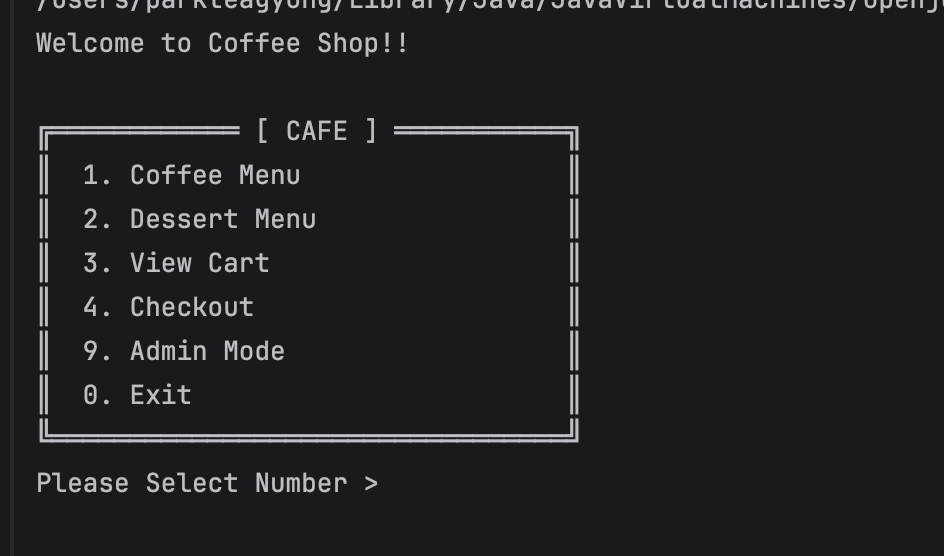
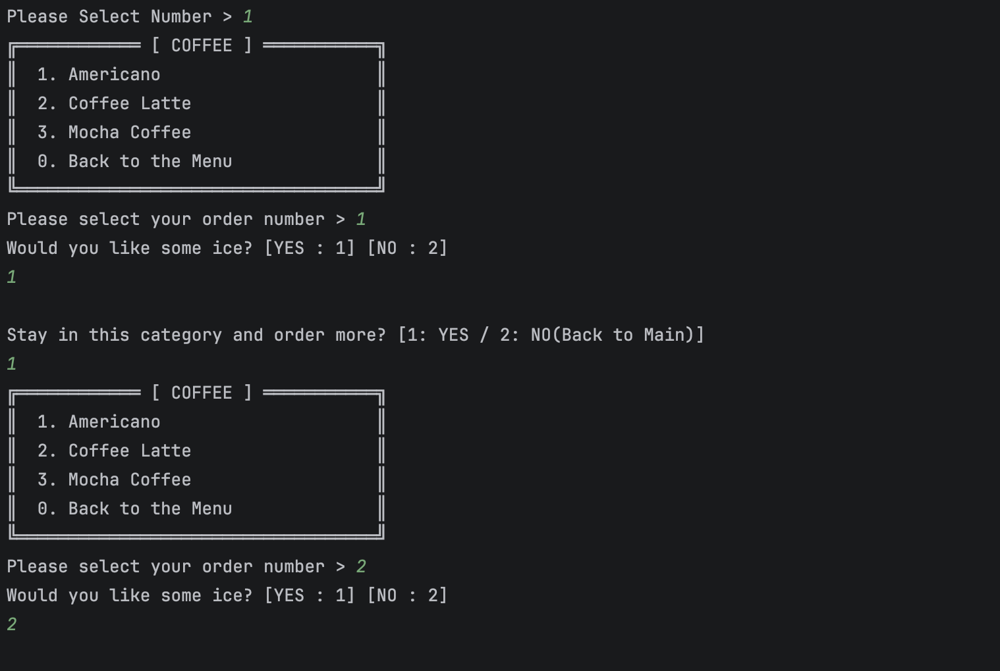
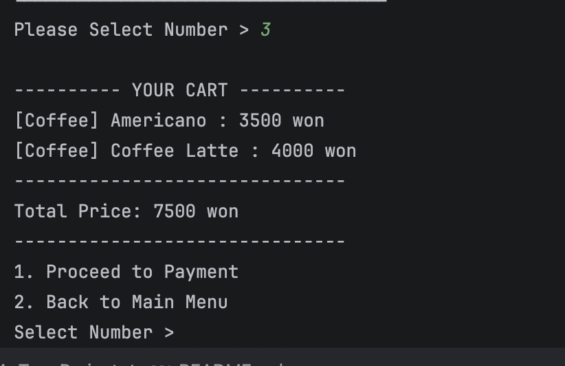
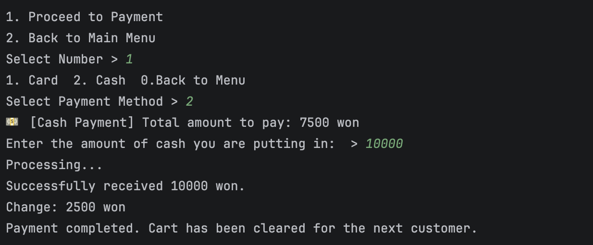
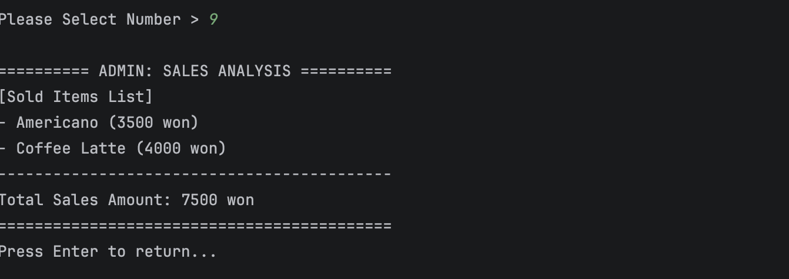

# TermProject: proposal

## Project title : Cafe kiosk System

## Team Members
* 박태경 - 22300333

## Project Description
  This project makes a cafe kiosk system using Java's Object-Oriented Programming(OOP). 
I use "Inheritance" to organize many menus like Coffee and Dessert easily. 
Also, I use "Polymorphism" to handle different payments like Credit Cards and Cash, making the code flexible. 
Users can see the menu, put items in a cart, and pay through the console screen. 
I also plan to add an "Administrator Mode" to check total sales and manage stock, just like a real cafe kiosk.

youtube link
https://youtu.be/DpBPE2HKuXs

## 1. User Guide

1. Main Menu Selection 
    - To browse the Coffee Menu, the user enters "1".
    - The system then displays the available coffee options, allowing the user to make a selection.
   
   
2. Select Your Order
   -	Once a specific coffee is selected, the user can choose between ICE or HOT options to customize their drink.
   
   
3. Viewing the Cart
   -	After adding items using options 1 (Coffee) or 2 (Dessert), the user can press "3" to check their Shopping Cart.
   -	This screen lists all selected items. From here, the user can choose to proceed to checkout or return 
        to the menu to add more items.
   
   
4. Payment Process
   -	By pressing "1" in the cart (or selecting the checkout option), the user enters the payment screen.
   -	Users can choose between Card or Cash.
   -	If Cash is selected, the system calculates and displays the change based on the amount received.
   
   
5. Admin Mode
   -	Entering "9" connects the user to Admin Mode.
   -	Through this mode, the manager can view the Total Sales Records for the day, 
        including a detailed list of sold items.

## 2. Class Diagram (Mermaid)

```mermaid
classDiagram
    %% Relationships
    Main --> Controller : uses
    Controller --> Coffee : manages
    Controller --> Dessert : manages
    Controller --> IPayment : uses
    
    Menu <|-- Coffee : inheritance
    Menu <|-- Dessert : inheritance
    
    IPayment <|.. CardPayment : realization
    IPayment <|.. CashPayment : realization

    %% Classes & Interfaces
    class Main {
        +main(String[] args)
        +run()
    }

    class Menu {
        -String name
        -int price
        +getName() String
        +getPrice() int
    }

    class Coffee {
        +Coffee(String name, int price, boolean isIce)
    }

    class Dessert {
        +Dessert(String name, int price)
    }

    class IPayment {
        <<interface>>
        +pay(int amount)*
    }

    class CardPayment {
        +pay(int amount)
    }

    class CashPayment {
        +pay(int amount)
    }

    class Controller {
        -Scanner sc
        -List~Coffee~ coffeeList
        -List~Dessert~ dessertList
        -List~Coffee~ coffeeCartList
        -List~Dessert~ dessertCartList
        -List~Coffee~ soldCoffeeList
        -List~Dessert~ soldDessertList
        -int totalSales
        +showMenu()
        +selectMenu(int category)
        +showCartList() boolean
        +toPay()
        +showAdminMode()
        +safeInput() int
    }
